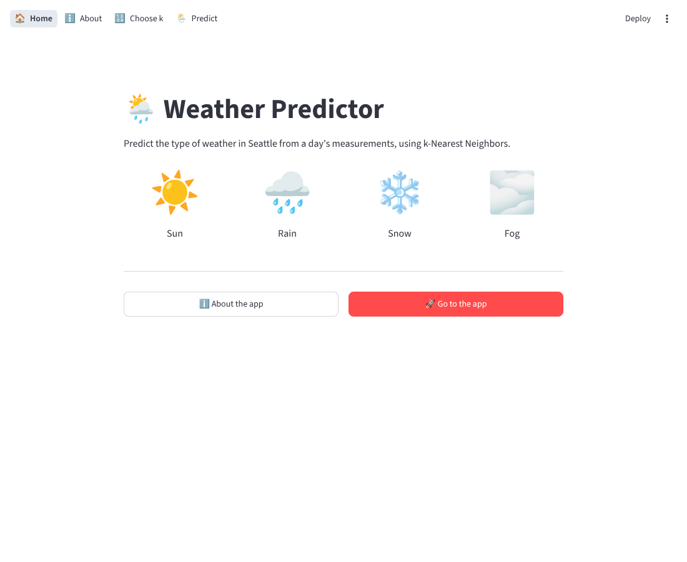
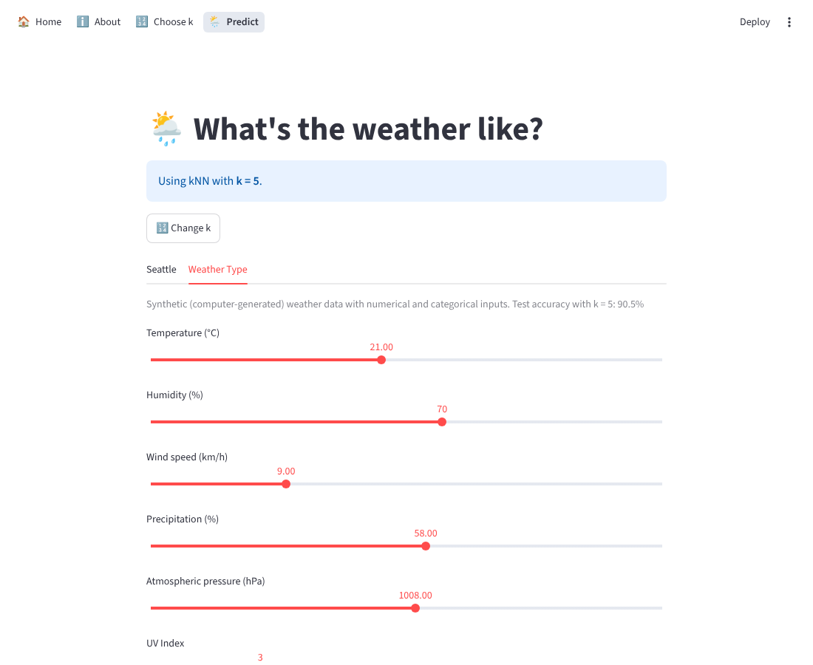

# Weather Predictor 🌦️

Machine learning web app built with **Python**, **scikit-learn** and **Streamlit**.  
It predicts the type of weather from a day's measurements using **k-Nearest Neighbors (kNN)**, trained on two different weather datasets.  
Course project for **DS2006 Introduction to Data Science** at Halmstad University.

🔗 **Live demo:** [weather-predict on Azure](https://weather-predict-degsfwa7fgcjhpeu.norwayeast-01.azurewebsites.net)  
*(Free hosting plan: the first load can take a minute while the app wakes up.)*

## 📸 Screenshots





## ✨ Key Features

- Two classification models side by side: real Seattle weather and synthetic weather data
- Choose the number of neighbors **k** and see the test accuracy update instantly
- Inputs are generated automatically: sliders for numerical features, dropdowns for categorical ones
- Prediction with an icon and a chart showing how the k nearest neighbors voted
- Multipage interface: Home, About, Choose k and Predict
- Automatic deployment to Azure on every push to `main`

## 📊 Datasets

| Dataset | Type | Inputs | Classes |
|---|---|---|---|
| [Seattle Weather](https://www.kaggle.com/datasets/ananthr1/weather-prediction) | Real data, Seattle 2012–2015 | Numerical only: precipitation, max/min temperature, wind | 5: sun, rain, drizzle, snow, fog |
| [Weather Type Classification](https://www.kaggle.com/datasets/nikhil7280/weather-type-classification) | Synthetic data | Numerical + categorical (cloud cover, season, location) | 4: Sunny, Cloudy, Rainy, Snowy |

## 🛠 Tech Stack

- **Language:** Python
- **Machine learning:** scikit-learn (kNN, Pipeline, StandardScaler, OneHotEncoder)
- **Data:** pandas
- **Web app:** Streamlit
- **Deployment:** Azure App Service, GitHub Actions (CI/CD)

## 🧠 How It Works

1. The data is split into **80% training** and **20% test** data (stratified, `random_state=10`).
2. Numerical features are scaled with **StandardScaler**; categorical features are converted with **OneHotEncoder**.
3. **kNN** finds the *k* most similar days in the training data and predicts the most common weather type among them.
4. The model is trained inside the app for the chosen k and cached, so each k is trained only once.

## 📁 Project Structure

```
ds2006-project/
├── app/
│   ├── app.py            # entry point: page settings and navigation
│   ├── model_utils.py    # dataset settings, loading data, training kNN
│   ├── views/            # home, about, choose_k, predict pages
│   └── images/           # photos used in the app
├── data/raw/             # original CSV files
├── src/main.py           # kNN experiments and evaluation
├── notebooks/            # data exploration
└── requirements.txt
```

## 🚀 Run Locally

```bash
git clone https://github.com/Bogdan2266/ds2006-project.git
cd ds2006-project
python -m venv .venv
source .venv/bin/activate        # Windows: .venv\Scripts\activate
pip install -r requirements.txt
streamlit run app/app.py
```

## 👥 Authors

- **Bohdan Gertsiuk** – [GitHub](https://github.com/Bogdan2266)
- **Axel Lundholm** – [GitHub](https://github.com/Axel0lexA)
