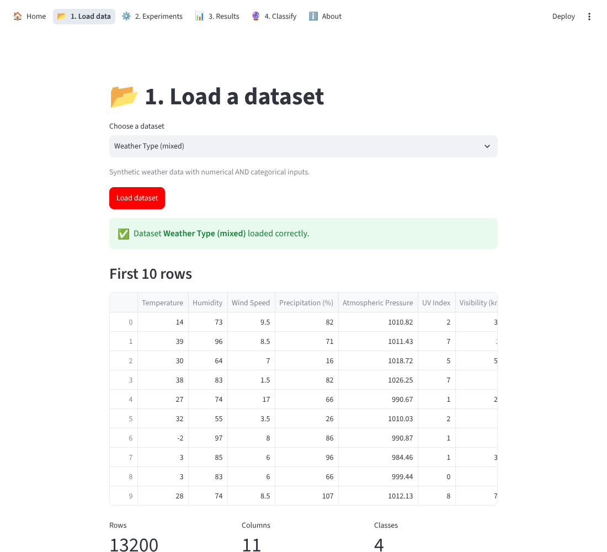
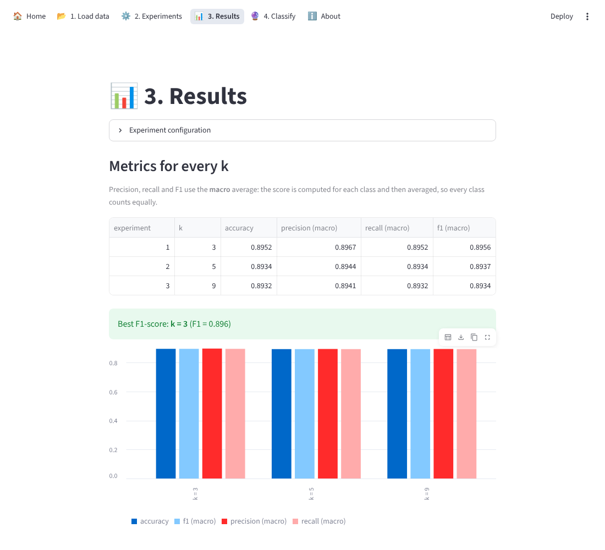
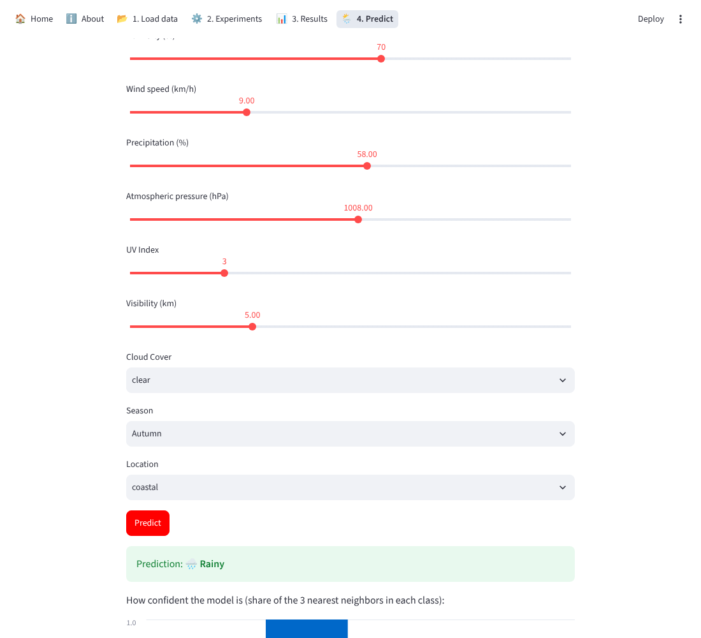

# Weather Lab 🌦️

A **Mini Data Science Laboratory** built with **Python**, **scikit-learn** and **Streamlit**.  
Load a weather dataset, design and compare **k-Nearest Neighbors (k-NN)** experiments, save the results, and use a trained model to classify new, unseen days.  
Course project for **DS2006 Introduction to Data Science** at Halmstad University.

🔗 **Live demo:** [weather-predict on Azure](https://weather-predict-degsfwa7fgcjhpeu.norwayeast-01.azurewebsites.net)  
*(Free hosting plan: the first load can take a minute while the app wakes up.)*

## 📸 Screenshots





## ✨ Key Features

- **Load & inspect** a dataset: first 10 rows, size, feature names and types, class counts, descriptive statistics
- **Data preparation**: scaling for numerical features, one-hot encoding for categorical features (also applied to new examples)
- **Evaluation strategies**: train/test split (custom percentages) or X-fold cross-validation, stratified or non-stratified
- **Several k-NN experiments at once** with the same evaluation setup, so results are fairly compared
- **Metrics** for every k: accuracy, precision, recall and F1-score (macro average)
- **Confusion matrix** for any experiment
- **Save results** to a CSV file with a custom name
- **Classify new examples** with a chosen trained model: enter values manually or upload a CSV file
- **Input validation** with clear messages instead of crashes

## 📊 Datasets

| Dataset | Type | Inputs | Classes |
|---|---|---|---|
| [Seattle Weather](https://www.kaggle.com/datasets/ananthr1/weather-prediction) | Real data, Seattle 2012–2015 | Numerical only: precipitation, max/min temperature, wind | 5: sun, rain, drizzle, snow, fog |
| [Weather Type Classification](https://www.kaggle.com/datasets/nikhil7280/weather-type-classification) | Synthetic data | 7 numerical + 3 categorical (cloud cover, season, location) | 4: Sunny, Cloudy, Rainy, Snowy |

## 🛠 Tech Stack

- **Language:** Python
- **Machine learning:** scikit-learn (KNeighborsClassifier, Pipeline, ColumnTransformer, StandardScaler, OneHotEncoder, KFold / StratifiedKFold)
- **Data:** pandas
- **Web app:** Streamlit
- **Deployment:** Azure App Service, GitHub Actions (CI/CD)

## 🧭 How to Use

1. **Load data** – choose a dataset and inspect it.
2. **Experiments** – choose train/test split or cross-validation, stratified or not, and the k values to test.
3. **Results** – compare the metrics, inspect confusion matrices and save the results.
4. **Predict** – pick a trained model and classify a new example (manually or from a CSV file).

## 📁 Project Structure

```
ds2006-project/
├── app/
│   ├── app.py            # entry point: page settings and navigation
│   ├── lab.py            # all data science logic (no Streamlit code)
│   ├── views/            # pages: home, load_data, experiments, results, classify, about
│   └── images/           # photos used in the app
├── data/raw/             # original CSV files
├── docs/screenshots/     # images for this README
└── requirements.txt
```

## 🚀 Run Locally

```bash
git clone https://github.com/Bogdan2266/ds2006-project.git
cd ds2006-project
python -m venv .venv
source .venv/bin/activate        # Windows: .venv\Scripts\activate
pip install -r requirements.txt
streamlit run app/app.py
```

## 👥 Authors

- **Bohdan Gertsiuk** – [GitHub](https://github.com/Bogdan2266)
- **Axel Lundholm** – [GitHub](https://github.com/Axel0lexA)
